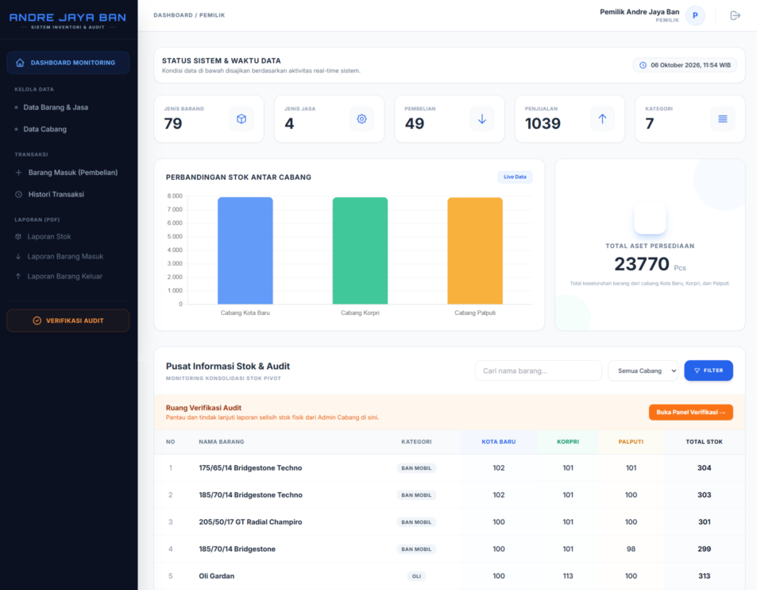
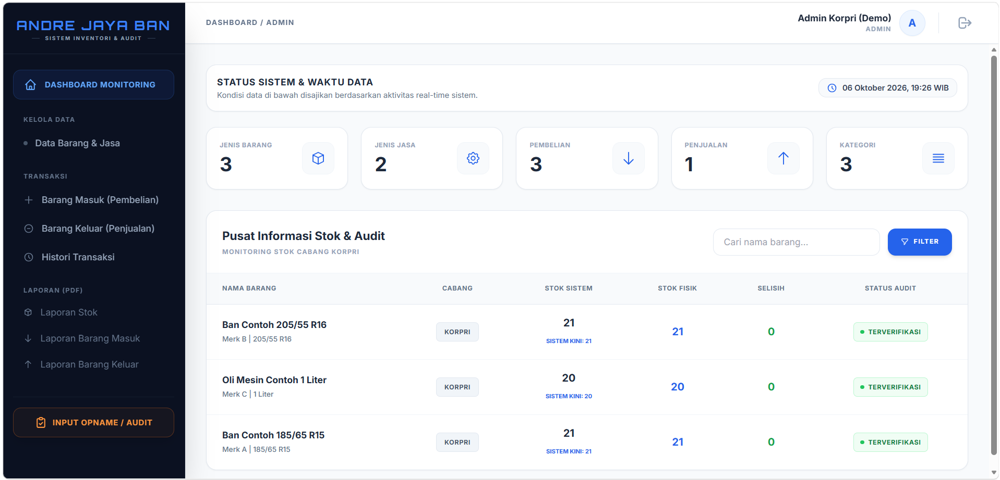
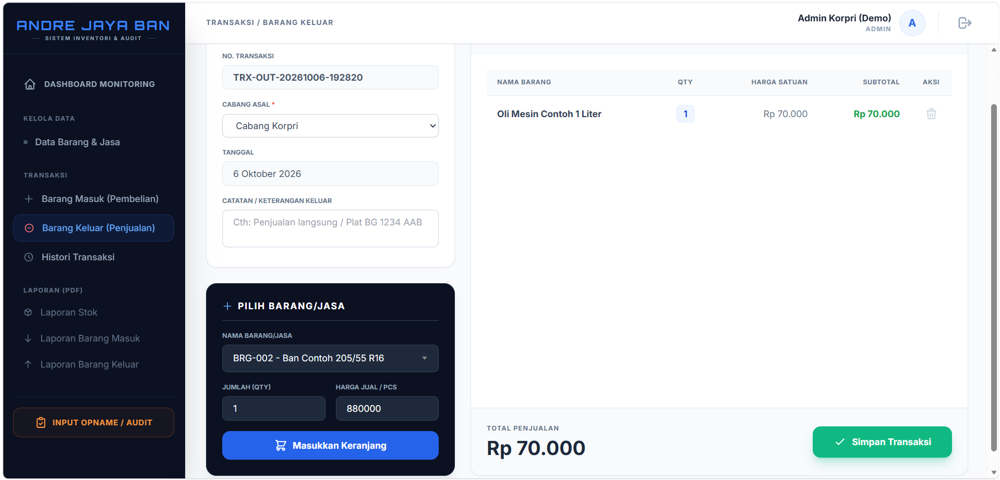

# Sistem Informasi Pengelolaan dan Audit Stok Barang

**Perpetual Inventory System | Studi Kasus: Toko Andre Jaya Ban**

Proyek skripsi S1 Sistem Informasi, Universitas Bandar Lampung, 2026.

> Kode sumber disimpan di repositori privat. Repositori ini berisi penjelasan dan tampilan sistem.
> Untuk keperluan akademik atau rekrutmen, silakan hubungi penulis.

## Tampilan Sistem

| Dashboard Pemilik | Dashboard Admin Cabang |
|---|---|
|  |  |

| Transaksi Barang Keluar | Verifikasi Audit (Pemilik) |
|---|---|
|  |  |

## Latar Belakang

Pencatatan stok di toko dengan tiga cabang sebelumnya semi-manual di Microsoft Excel, sehingga rawan *human error* dan sering terjadi selisih antara catatan dan stok fisik. Sistem ini memperbarui stok otomatis pada setiap transaksi dan menyediakan alur audit stok yang terdokumentasi.

## Fitur

- Login berbasis peran: **Pemilik** (memantau semua cabang) dan **Admin Cabang** (mengelola cabangnya sendiri)
- Dashboard monitoring dengan pembaruan stok real-time untuk Pemilik
- Kelola data cabang, barang, dan jasa
- Transaksi barang masuk (pembelian) dan barang keluar (penjualan)
- Stok bertambah dan berkurang otomatis di setiap transaksi; penjualan ditolak jika stok tidak cukup
- Riwayat transaksi dan cetak nota
- Laporan stok, barang masuk, dan barang keluar
- Audit stok: Admin Cabang mengisi stok fisik, barang dikunci dari penjualan, lalu Pemilik memverifikasi dan stok disesuaikan

## Teknologi

Laravel 12, PHP, MySQL, Tailwind CSS, Laravel Reverb, Vite. Metode pengembangan: Waterfall.

## Hasil Pengujian

- White Box dan Black Box Testing: seluruh fungsi modul berjalan sesuai rancangan.
- Pre-test dan post-test kepuasan operasional: naik 42% (Pemilik) dan 40,67% (Admin Cabang).

## Keterbatasan

Sistem belum digunakan untuk operasional harian, dan tampilan di smartphone untuk halaman dengan data padat masih perlu disempurnakan.

## Penulis

**Ester Belen Wijaya** | Program Studi Sistem Informasi, Universitas Bandar Lampung
LinkedIn: TEMPEL-TAUTAN-LINKEDIN-ANDA

## Hak Cipta

Hak cipta © 2026 Ester Belen Wijaya. Seluruh hak dilindungi. Konten dalam repositori ini tidak boleh disalin atau didistribusikan tanpa izin tertulis dari penulis.
